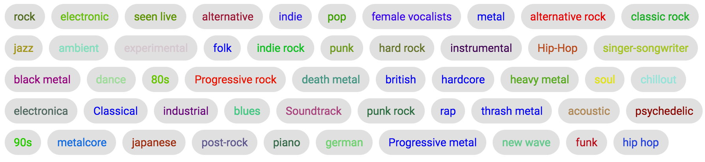

## react redux music db

##[demo](http://react-redux-music.surge.sh/)

[create-react-app](https://github.com/facebookincubator/create-react-app) is used as a boilerplate.

run 'npm install' to download the dependencies.

run 'yarnpkg start' to run the app.

